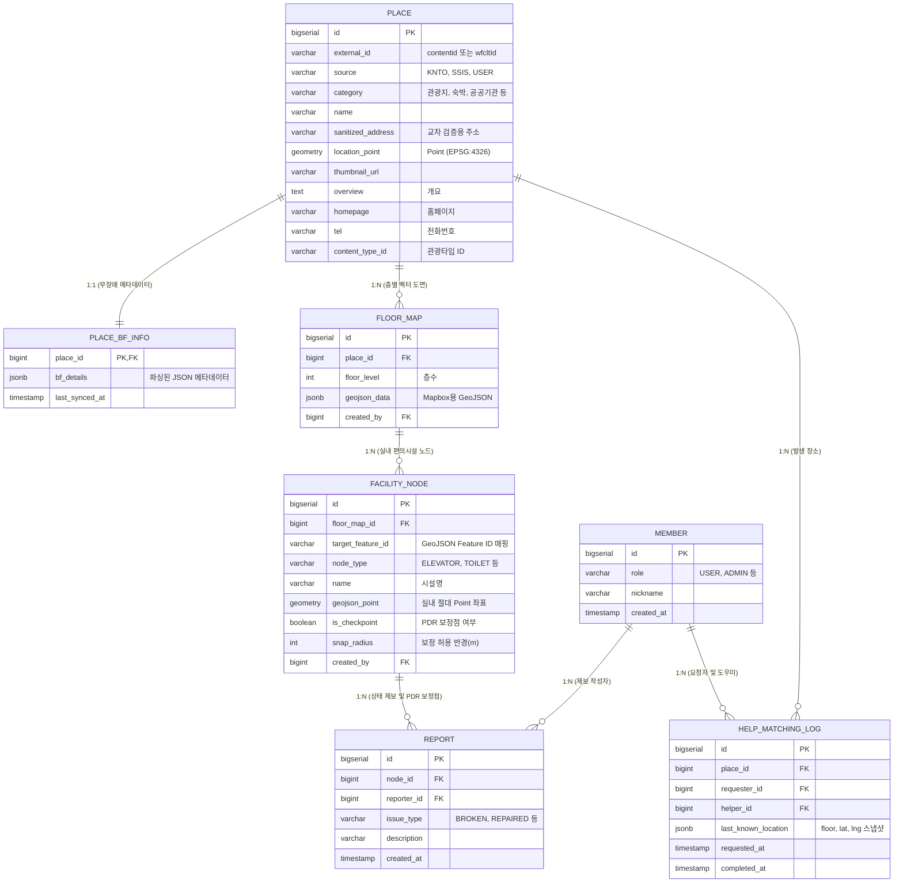

# ADR-0000: Data Modeling & Schema Design for Barrier-Free Tourism Service

## Context
"함께가길" (goto) 서비스는 야외 관광지(PLACE), 무장애 편의시설 정보(PLACE_BF_INFO), 실내 도면 정보(FLOOR_MAP, FACILITY_NODE), 사용자의 실시간 편의시설 상태 제보(REPORT), 교통약자 이동 보정을 위한 보정점, 그리고 도움 요청 및 제공 매칭 기록(HELP_MATCHING_LOG) 등을 효율적으로 영속화해야 합니다.
서비스의 확장성, 다양한 데이터 소스 연동 시의 데이터 충돌 가능성, 대용량 실내외 공간 쿼리 성능, 가변적인 장애 상세 정보 조회 스펙 등을 고려하여 최적의 데이터베이스 모델링 및 아키텍처적 결정을 수립해야 합니다.

---

## 1. Separation of Surrogate Keys and External IDs (대리키 분리)

### Context & Alternatives
외부 데이터 소스(한국관광공사 OpenAPI의 `contentId`, 향후 연동할 수 있는 타 기관 데이터의 고유 ID, 사용자 제보 데이터 등)는 고유 식별자 체계가 서로 다르며, 데이터 소스가 다를 경우 동일한 ID 값으로 인해 중복이나 충돌이 발생할 수 있습니다.
* **대안 A**: 외부 ID(예: `contentId`)를 PK로 설정 (다양한 소스 연동 시 PK 충돌 위험, 외부 API 변경 시 영향도 높음).
* **대안 B (채택)**: 모든 도메인 테이블의 PK는 시스템 내부 대리키(`bigserial id`)로 설정하고, 외부 ID는 `external_id` (VARCHAR) 컬럼에, 데이터 소스 정보는 `source` (VARCHAR) 컬럼에 저장하여 분리 관리.

### Decision
* **대안 B**를 채택하여, 내부적인 테이블 관계(Join)는 내부 대리키를 외래키(FK)로 활용하여 무결성을 유지하고, 외부 연동 키는 유니크 인덱스로 결합하여 식별합니다.

### Consequences
* 데이터 소스 확장성 확보: 추후 `source`가 'KNTO', 'SSIS', 'USER' 등으로 다양해져도 내부 ID 체계가 흔들리지 않음.
* 외부 데이터 중복 저장을 방지하기 위해 `PLACE` 테이블에 `(external_id, source)` 복합 유니크 제약 조건을 설정해야 함.

---

## 2. PostgreSQL JSONB Type for Barrier-Free Metadata (무장애 상세 정보의 JSONB 설계)

### Context & Alternatives
한국관광공사 무장애 API에서 제공하는 무장애 편의 필드는 주차장, 경사로, 엘리베이터, 점자블록, 안내견, 수유실 등 100개에 가까운 다양한 세부 항목들이 존재하며, 이는 신체 유형(지체, 시각, 청각, 영유아 동반 등)에 따라 다르게 분석되어야 합니다.
* **대안 A**: 모든 상세 편의 여부를 100여 개의 테이블 컬럼으로 정규화하여 설계 (스키마의 극심한 비대화, 가변적인 API 필드 확장에 취약, Null 데이터 과다 발생).
* **대안 B**: 1:1 관계의 상세 정보 테이블 `PLACE_BF_INFO`를 생성하고, 상세 편의 항목들을 정형화된 JSONB 타입 컬럼 `bf_details`에 구조화하여 저장.

### Decision
* **대안 B**를 채택하여 PostgreSQL의 **`JSONB`** 데이터 타입을 활용합니다.
* JSONB 내부 스키마는 신체/상황별 카테고리(`mobility`, `visual`, `hearing`, `infant_family`)로 나누고, 검색 조건의 핵심이 되는 `is_available` 필드를 최상위 계층에 둔 구조로 정의합니다.
  ```json
  {
    "mobility": {
      "wheelchair": { "is_available": true, "count": 2, "details": "수동휠체어 2대 대여가능" },
      "parking": { "is_available": true, "count": null, "details": "장애인 전용 주차장 있음" }
    },
    "visual": {
      "guide_dog": { "is_available": true, "details": "안내견 동반 가능" }
    }
  }
  ```

### Consequences
* 유연성 극대화: 새로운 편의 사양 필드가 공공데이터나 제보로 수집되어도 스키마 변경 마이그레이션(DDL) 없이 유연하게 적재 및 변경 가능.
* 조회 성능 보완: JSONB 특정 경로(`is_available`)에 대해 GIN 인덱스를 생성하여, 특정 편의시설을 보유한 장소만 필터링하는 조건 검색 쿼리를 인덱스 범위 내에서 빠르게 수행 가능.

---

## 3. Segregation of Indoor Map GeoJSON and Facility Nodes (실내 지도 도면과 편의 노드 분리)

### Context & Alternatives
건물 실내 지도 렌더링에 적합한 Mapbox용 벡터 폴리곤 도면 데이터와, 해당 도면 위에서 실시간 상태 제보나 PDR(보행자 데드레코닝) 위치 정밀 계산에 사용되는 물리 편의시설 좌표 데이터를 하나로 합칠지 분리할지에 대한 아키텍처 결정입니다.
* **대안 A**: GeoJSON 피처 데이터 안에 모든 노드 스펙을 내장하여 하나의 컬럼으로 관리 (노드의 상태 변화, 제보 이력, 트래킹 연산 시 매번 대형 GeoJSON 데이터를 파싱하고 덮어써야 하여 성능에 극도로 취약).
* **대안 B (채택)**: 전체적인 도면 렌더링 및 영역 정보는 `FLOOR_MAP.geojson_data` (JSONB)로 보관하고, 상태 관리 및 보정점 연산이 필요한 개별 편의시설은 `FACILITY_NODE` 테이블로 명확히 분리 설계.

### Decision
* **대안 B**를 채택하여 논리적 및 물리적 테이블 구조를 격리시킵니다.
* `FLOOR_MAP` 내의 특정 GeoJSON `feature`와 `FACILITY_NODE`는 외래키 대신 느슨한 문자열 고유 식별자인 `target_feature_id` (예: `properties.node_id`)를 활용하여 논리적으로 매핑합니다.

### Consequences
* 프론트엔드는 도면 렌더링 시 대용량 GeoJSON 데이터(`FLOOR_MAP`)를 불러와 캔버스에 그리고, 노드의 상태(고장 여부, 임시 점검 등)나 상세 제보 데이터는 가벼운 `FACILITY_NODE` 단독 조회 쿼리를 통해 효율적으로 매핑하여 화면에 동적 표시 가능.

---

## 4. PDR Calibration Checkpoints & Report Scheme (보행자 센서 보정 및 제보 설계)

### Context & Alternatives
실내에서는 GPS 신호 수신이 불가능하여 스마트폰 센서 기반의 PDR(Pedestrian Dead Reckoning - 보행자 추측 항법) 기술을 사용합니다. PDR은 시간이 지날수록 센서 오차(Drift)가 누적되므로, 특정 위치(예: 엘리베이터 앞, 화장실 입구 등)를 지날 때 스마트폰의 위치를 해당 노드 위치로 보정(Snapping)해 주어야 합니다.

### Decision
* `FACILITY_NODE` 테이블에 보정(Snap) 계산에 필수적인 컬럼인 **`is_checkpoint`** (보정 영점 조절 가능 지점 여부)와 **`snap_radius`** (보정을 허용할 오차 반경(m)) 컬럼을 명시적으로 추가합니다.
* 사용자의 현장 제보(`REPORT`) 테이블에는 제보 시점의 시간인 **`created_at`** 컬럼을 두어, 해당 시점의 센서 수치 보정 및 제보 신뢰도 시간 범위를 추적할 수 있도록 설계합니다.

### Consequences
* PDR 엔진이 보정점(`is_checkpoint = true`) 근처의 누적 센서 이동 궤적을 실시간으로 스냅 계산하여 실내 내비게이션 정확도를 크게 제고함.

---

## 5. PostGIS Spatial Indexing & pg_trgm GIN Indexing (공간 및 검색 성능 최적화)

### Context & Alternatives
사용자 현재 위치 반경 내 무장애 장소 검색 및 키워드 유사어 검색 시, DB 전체를 풀 스캔할 경우 대용량 데이터 환경에서 모바일 응답 속도가 급격히 저하됩니다.

### Decision
1. **공간 인덱스**: `PLACE` 테이블의 `location_point` (PostGIS `geometry` 타입) 컬럼에 **`GIST`** 인덱스를 생성하여 반경 쿼리(`ST_DWithin`, `ST_Distance` 등)를 고속화합니다.
2. **문자열 검색 인덱스**: `PLACE` 테이블의 `name` 컬럼에 **`pg_trgm`** PostgreSQL 확장을 활용한 **`GIN`** 인덱스를 생성하여 한국어 자모 검색 및 부분 일치 검색 속도를 보장합니다.

### Consequences
* 반경 공간 쿼리와 키워드 유사도 검색이 밀리세컨드(ms) 단위의 응답 속도로 처리되어 모바일 사용자 경험 향상.
* 스키마 생성 시 Flyway 마이그레이션 스크립트에 `CREATE EXTENSION IF NOT EXISTS postgis;` 및 `CREATE EXTENSION IF NOT EXISTS pg_trgm;` 구문이 반드시 선행적으로 반영되어야 함.

---

## 6. Entity Relationship Diagram (ERD 구조 요약)

구현의 기본 뼈대가 되는 최종 데이터베이스 관계 모델은 다음과 같습니다.


