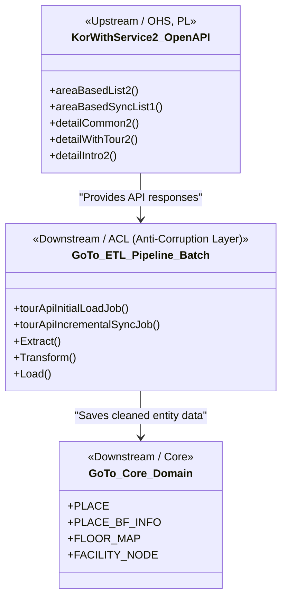

# GoTo Project Context Map & Documentation Directory

본 문서는 "함께가길" (goto) 프로젝트의 전체 아키텍처 도메인 관계(Context Map)와 프로젝트 내부의 각종 설계·스펙 문서들의 거시적인 지도를 제공합니다.
특히 **AI 에이전트(개발 도구) 및 인간 개발자**가 개발 상황에 따라 어떤 문서를 참조하여 컨텍스트를 파악해야 하는지 명확히 규정합니다.

---

## 1. Documentation Directory Schema (adr vs specs)

프로젝트 문서들은 성격에 따라 **`adr` (Architecture Decision Records - 아키텍처 및 트레이드오프 결정)**과 **`specs` (Implementation Specs - 세부 구현 스펙 및 정형 데이터 명세)**의 두 가지 카테고리로 엄격히 분류됩니다.

```
docs/
├── adr/
│   ├── 0000_adr_data_modeling.md  # [adr] 데이터 모델링 구조 결정 및 PostGIS, JSONB 트레이드오프
│   ├── 0001_adr_etl_pipeline.md   # [adr] 초기 ETL 파이프라인 설계. 0002에 의해 부분 대체됨
│   └── 0002_adr_incremental_sync_pipeline.md  # [adr] 증분 동기화, 자동 초기 적재, 스케줄러 가드
├── context_map.md                 # 본 문서 (전체 지도 및 도메인 컨텍스트 맵)
└── specs/
    └── batch_upsert_strategy_spec.md  # [spec] PlaceItemWriter 기반 벌크 Upsert 구현 스펙
```

### 1.1. `adr` 카테고리 (Architecture Decision Records)
* **목적**: 특정 기술 스택을 선택한 배경, 아키텍처적 트레이드오프, 포기한 대안과 선택한 결정의 결과(Consequences)를 보관합니다.
* **표준 작성 규칙 (Frontmatter 필수)**:
  모든 ADR 문서는 반드시 파일 최상단에 아래와 같이 YAML 형식의 Frontmatter를 포함하여 작성해야 합니다:
  ```yaml
  ---
  author: 강민준 (joonamin44@gmail.com)
  date: YYYY-MM-DD
  status: Accepted | Proposed | Superseded
  ---
  ```
  * **Status 상태 전이 규칙**: 
    - `Proposed`: 제안 상태. 검토 대기 중.
    - `Accepted`: 승인 및 적용됨.
    - `Superseded`: 새로운 결정(다른 ADR)에 의해 대체되거나 폐기됨. 기존 문서의 상태를 `Superseded`로 변경하고, 어떤 ADR로 대체되었는지 본문 상단에 명확한 링크와 함께 명시해야 합니다.
* **해당 문서**:
  * [0000_adr_data_modeling.md](adr/0000_adr_data_modeling.md): 데이터 대리키 분리, JSONB 무장애 상세 스펙, 실내 지도 도면/시설 노드 이중화 분리, PDR 센서 보정을 위한 스냅점 설계 및 PostGIS 공간/GIN 인덱싱 전략 등.
  * [0001_adr_etl_pipeline.md](adr/0001_adr_etl_pipeline.md) **[Superseded]**: HTTP RestClient 적용, Spring Batch 프레임워크 선택, 에러 핸들링 등 초기 전체 데이터 적재 파이프라인의 동작 방식.
  * [0002_adr_incremental_sync_pipeline.md](adr/0002_adr_incremental_sync_pipeline.md): 증분 동기화(Incremental Sync) 아키텍처, 자동 초기 적재, Eager-Lazy Fallback 전략, Soft Delete 및 스케줄러 가드 도입.

### 1.2. `specs` 카테고리 (Implementation Specs)
* **목적**: 실제 코드 구현과 물리 데이터베이스 설계에 반영되어야 하는 세부 물리 규격, API 상세 페이로드 포맷, ERD 명세를 보관하는 카테고리입니다.
* **해당 문서**:
  * [batch_upsert_strategy_spec.md](specs/batch_upsert_strategy_spec.md): Spring Batch `PlaceItemWriter`의 PostgreSQL native Upsert, soft delete 반영, `place_bf_info` 저장 정책.

---

## 2. Bounded Context Map (도메인 아키텍처 관계)

"함께가길" 시스템의 내부 핵심 도메인과 외부 한국관광공사 OpenAPI 간의 관계는 아래의 Context Map과 같습니다.



### 컨텍스트 간의 관계 설명
1. **Open Host Service (OHS) / Published Language (PL)**:
   * 현재 구현 기준 한국관광공사 OpenAPI(`KorWithService2`)는 외부 시스템이며, 규격화된 프로토콜(JSON)과 엔드포인트를 제공하는 상류(Upstream) 시스템입니다.
2. **Anti-Corruption Layer (ACL - 부패방지계층)**:
   * 내부 코어 도메인이 외부 API의 복잡하고 일관되지 않은 텍스트 포맷이나 가변 스키마에 오염되는 것을 막기 위해 `GoTo_ETL_Pipeline_Batch`가 ACL 역할을 수행합니다.
   * `RestClient`와 Record DTO를 이용해 데이터를 안전하게 가져오고, 좌표 검증, PostGIS Geometry 변환, 홈페이지 URL 정제, soft delete 매핑을 통해 정제된 데이터만 내부 코어 도메인으로 공급합니다.
3. **Core Domain**:
   * 정제된 데이터는 로컬 `PLACE` 및 `PLACE_BF_INFO` 테이블로 안전하게 영속화됩니다.

---

## 3. ETL Pipeline System Architecture

Spring Batch 기반으로 동작하는 ETL 파이프라인의 시스템 아키텍처 및 데이터 흐름은 다음과 같습니다.

```mermaid
flowchart TD
    subgraph External_APIs [External OpenAPI Services]
        KNTO_Barrier[KorWithService2 무장애 API]
    end

    subgraph Spring_Boot_Application [Spring Boot ETL Jobs]
        AppReady[ApplicationReadyEvent]
        InitialRunner[TourApiInitialLoadRunner]
        Scheduler[@Scheduled 03:00 Scheduler]
        InitialStatus[TourApiInitialLoadStatus]
        InitialJob[tourApiInitialLoadJob]
        IncrementalJob[tourApiIncrementalSyncJob]
        
        subgraph Initial_Steps [Initial Load Steps]
            BaseReader[areaBasedList2 Reader]
            BaseProcessor[Base Processor]
            Writer[Upsert ItemWriter]
            DetailReader[Lazy Detail Reader]
            DetailProcessor[Detail Processor]
        end

        subgraph Incremental_Steps [Incremental Sync Steps]
            IncrementalReader[areaBasedSyncList1 Reader]
            IncrementalProcessor[Eager Detail Processor]
            SharedDetailReader[Shared Lazy Detail Reader]
            IncrementalSyncLogListener[Incremental Sync Log Listener]
        end
    end

    subgraph Database [PostgreSQL / PostGIS Database]
        PlaceTbl[(PLACE Table)]
        BfInfoTbl[(PLACE_BF_INFO Table)]
        DlqTbl[(ETL_FAILURE_LOG DLQ)]
        BatchMeta[(Spring Batch Meta Tables)]
        SyncLog[(BATCH_SYNC_LOG)]
    end

    AppReady --> InitialRunner
    InitialRunner -->|auto-run-enabled=true and no COMPLETED execution| InitialJob
    InitialStatus -.->|Read initial load status| BatchMeta
    InitialRunner -.-> InitialStatus
    Scheduler -.->|Skip until initial load COMPLETED| InitialStatus
    Scheduler -->|Trigger| IncrementalJob
    
    InitialJob --> BaseReader --> BaseProcessor --> Writer
    InitialJob --> DetailReader --> DetailProcessor --> Writer
    IncrementalJob --> IncrementalReader --> IncrementalProcessor --> Writer
    IncrementalJob --> SharedDetailReader --> DetailProcessor
    
    BaseReader -->|areaBasedList2| KNTO_Barrier
    IncrementalReader -->|areaBasedSyncList1| KNTO_Barrier
    DetailReader -->|detailCommon2/detailWithTour2/detailIntro2 for is_deleted=false| KNTO_Barrier
    SharedDetailReader -->|detailCommon2/detailWithTour2/detailIntro2 for is_deleted=false| KNTO_Barrier
    IncrementalProcessor -->|Eager detail fetch| KNTO_Barrier
    BaseProcessor -->|Error Detected| DlqTbl
    IncrementalProcessor -->|Error Detected| DlqTbl
    
    Writer -->|Upsert: INSERT ON CONFLICT| PlaceTbl
    Writer -->|Upsert: PlaceBfDetails JSONB with sources.tour_api| BfInfoTbl
    IncrementalReader -.->|Read last successful target_date as requestDate| SyncLog
    IncrementalReader -.->|Register requestDate and next targetDate| IncrementalSyncLogListener
    IncrementalSyncLogListener -->|Write SUCCESS/FAIL result| SyncLog
    InitialJob -.->|Manage State| BatchMeta
    IncrementalJob -.->|Manage State| BatchMeta
```

현재 `batch_sync_log`는 증분 Reader가 마지막 성공 기준일을 조회하고, `TourApiIncrementalSyncLogListener`가 증분 Job 종료 후 `SUCCESS` 또는 `FAIL` 이력을 누적하는 용도로 사용합니다. Reader는 마지막 성공 `target_date`를 이번 실행의 `modifiedtime` 요청 기준일(`requestDate`)로 사용하고, KST 기준 실행일을 성공 시 저장할 다음 기준일(`targetDate`)로 Job context에 함께 등록합니다. `SUCCESS` 이력의 `target_date`만 다음 증분 실행의 `modifiedtime` 기준이 되며, `FAIL` 이력의 `target_date`는 실패한 실행이 실제 요청한 기준일을 기록합니다.

Lazy Detail Fetch Step은 `is_deleted=false`이면서 `detail_common_synced`, `detail_with_tour_synced`, `detail_intro_synced` 중 하나라도 false인 Tour API 장소만 상세 보강 대상으로 삼습니다. 삭제된 장소(`is_deleted=true`)의 상세 정보 최신화가 향후 관리자/감사 요구사항이 된다면, 현재 detail step과 별도의 수집 정책을 설계해야 합니다.

---

## 4. AI Reference Guidelines (AI를 위한 참조 가이드)

향후 AI 에이전트가 본 프로젝트에서 특정 업무를 지시받았을 때, **실수를 줄이고 일관된 규칙을 따르기 위해 반드시 먼저 참조해야 하는 원천 문서(Source of Truth) 매핑**입니다.

### 4.1. 작업 시나리오별 참조 파일 매핑

| 개발 요구사항 (Task) | 우선 참조 문서 1 순위 | 우선 참조 문서 2 순위 | 참조 목적 및 주의사항 |
| :--- | :--- | :--- | :--- |
| **데이터베이스 스키마 및 엔티티 변경** | [0000_adr_data_modeling.md](adr/0000_adr_data_modeling.md) | N/A | 대리키 PK 원칙, JSONB 구조, PostGIS 공간 타입 및 pg_trgm 인덱스 규칙을 따라야 함. |
| **ETL 배치 구현 및 수정** | [0002_adr_incremental_sync_pipeline.md](adr/0002_adr_incremental_sync_pipeline.md) | [batch_upsert_strategy_spec.md](specs/batch_upsert_strategy_spec.md) | 현재 Accepted 상태의 증분 동기화, 자동 초기 적재, 스케줄러 가드, Upsert 구현 스펙을 우선 준수해야 함. |
| **장소 상세 및 무장애 정보 조회 API 개발 (웹 백엔드)** | [0000_adr_data_modeling.md](adr/0000_adr_data_modeling.md) | [batch_upsert_strategy_spec.md](specs/batch_upsert_strategy_spec.md) | ADR-0000의 목표 JSONB 구조와 현재 `place_bf_info.bf_details` 적재 정책을 함께 확인해야 함. |
| **실내 지도/도면 렌더링 개발 (프론트/백엔드)** | [0000_adr_data_modeling.md](adr/0000_adr_data_modeling.md) | N/A | `FLOOR_MAP.geojson_data` 및 `FACILITY_NODE.target_feature_id` 매핑 관계를 참고해야 함. |

### 4.2. AI 행동 강령
1. **의사 결정 트레이드오프 파악 시**: `docs/adr/` 디렉토리의 ADR 중 frontmatter `status: Accepted`인 문서를 우선 참조합니다. `Superseded` 문서는 히스토리 확인 용도로만 읽고, 현재 구현 지침으로 삼지 않습니다.
2. **구현 스펙 파악 시**: Accepted ADR이 정한 경계와 결정 사항을 먼저 확인한 뒤, `docs/specs/`의 구현 스펙을 대조합니다. ADR과 spec이 충돌하면 Accepted ADR을 우선하고, spec을 갱신 대상으로 표시합니다.
3. **새로운 의사 결정 필요 시**: 사용자와의 상의 및 `/grill-me` 등의 논의를 통해 합의된 사항을 `docs/adr/` 하위에 새로운 접두사 숫자(예: `0003_adr_...`)를 붙여 추가 기록하고, `context_map.md`에 이를 등록합니다.
