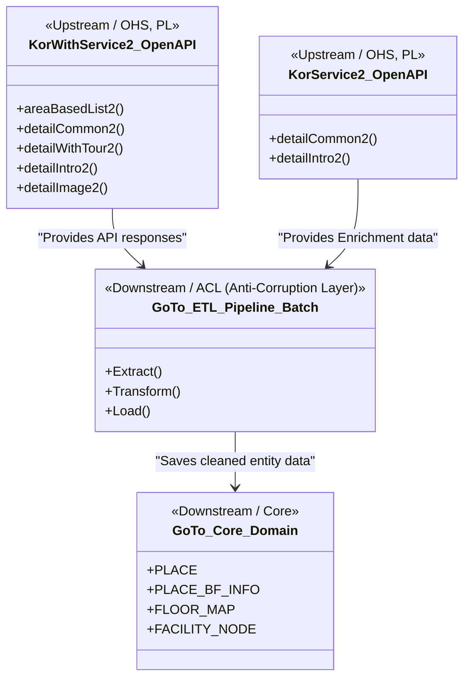

# GoTo Project Context Map & Documentation Directory

본 문서는 "함께가길" (goto) 프로젝트의 전체 아키텍처 도메인 관계(Context Map)와 프로젝트 내부의 각종 설계·스펙 문서들의 거시적인 지도를 제공합니다.
특히 **AI 에이전트(개발 도구) 및 인간 개발자**가 개발 상황에 따라 어떤 문서를 참조하여 컨텍스트를 파악해야 하는지 명확히 규정합니다.

---

## 1. Documentation Directory Schema (adr vs specs)

프로젝트 문서들은 성격에 따라 **`adr` (Architecture Decision Records - 아키텍처 및 트레이드오프 결정)**과 **`specs` (Implementation Specs - 세부 구현 스펙 및 정형 데이터 명세)**의 두 가지 카테고리로 엄격히 분류됩니다.

```
docs/
├── adr/
│   ├── 0000_adr_data_modeling.md  # [adr] 데이터 모델링 구조 결정 및 PostGIS, JSONB 트레이드오프
│   └── 0001_adr_etl_pipeline.md   # [adr] ETL 파이프라인 아키텍처 결정 사항 및 트레이드오프
├── context_map.md                 # 본 문서 (전체 지도 및 도메인 컨텍스트 맵)
└── specs/                         # (추후 추가 예정) 상세 구현 스펙 및 상세 인터페이스 명세 경로
```

### 1.1. `adr` 카테고리 (Architecture Decision Records)
* **목적**: 특정 기술 스택을 선택한 배경, 아키텍처적 트레이드오프, 포기한 대안과 선택한 결정의 결과(Consequences)를 보관합니다.
* **표준 작성 규칙 (Frontmatter 필수)**:
  모든 ADR 문서는 반드시 파일 최상단에 아래와 같이 YAML 형식의 Frontmatter를 포함하여 작성해야 합니다:
  ```yaml
  ---
  author: 강민준 (joonamin44@gmail.com)
  date: YYYY-MM-DD
  status: Accepted | Proposed | Superseded
  ---
  ```
* **해당 문서**:
  * [0000_adr_data_modeling.md](backend/docs/adr/0000_adr_data_modeling.md): 데이터 대리키 분리, JSONB 무장애 상세 스펙, 실내 지도 도면/시설 노드 이중화 분리, PDR 센서 보정을 위한 스냅점 설계 및 PostGIS 공간/GIN 인덱싱 전략 등.
  * [0001_adr_etl_pipeline.md](backend/docs/adr/0001_adr_etl_pipeline.md): HTTP RestClient 적용, Spring Batch 프레임워크 선택, 에러 핸들링(DLQ 테이블 패턴), 중복 처리(Upsert) 등 ETL 파이프라인 전반의 동작 방식을 기술함.

### 1.2. `specs` 카테고리 (Implementation Specs)
* **목적**: 실제 코드 구현과 물리 데이터베이스 설계에 반영되어야 하는 세부 물리 규격, API 상세 페이로드 포맷, ERD 명세를 보관하는 카테고리입니다.
* **해당 문서**: (현재 구현 스펙 확정 시 작성하여 본 폴더에 추가할 예정입니다.)

---

## 2. Bounded Context Map (도메인 아키텍처 관계)

"함께가길" 시스템의 내부 핵심 도메인과 외부 한국관광공사 OpenAPI 간의 관계는 아래의 Context Map과 같습니다.



### 컨텍스트 간의 관계 설명
1. **Open Host Service (OHS) / Published Language (PL)**:
   * 한국관광공사 OpenAPI(`KorWithService2`, `KorService2`)는 외부 시스템이며, 규격화된 프로토콜(JSON)과 엔드포인트를 제공하는 상류(Upstream) 시스템입니다.
2. **Anti-Corruption Layer (ACL - 부패방지계층)**:
   * 내부 코어 도메인이 외부 API의 복잡하고 일관되지 않은 텍스트 포맷이나 가변 스키마에 오염되는 것을 막기 위해 `GoTo_ETL_Pipeline_Batch`가 ACL 역할을 수행합니다.
   * `RestClient`와 Record DTO를 이용해 데이터를 안전하게 가져오고, `is_available` 파싱 로직 및 PostGIS Geometry 변환 가공 로직을 통해 정제된 데이터만 내부 코어 도메인으로 공급합니다.
3. **Core Domain**:
   * 정제된 데이터는 로컬 `PLACE` 및 `PLACE_BF_INFO` 테이블로 안전하게 영속화됩니다.

---

## 3. ETL Pipeline System Architecture

Spring Batch 기반으로 동작하는 ETL 파이프라인의 시스템 아키텍처 및 데이터 흐름은 다음과 같습니다.

```mermaid
flowchart TD
    subgraph External_APIs [External OpenAPI Services]
        KNTO_Barrier[KorWithService2 무장애 API]
        KNTO_Gov[KorService2 국문 API]
    end

    subgraph Spring_Boot_Application [Spring Boot ETL Job]
        Scheduler[@Scheduled Scheduler]
        BatchJob[Spring Batch ETL Job]
        
        subgraph Step_1 [Chunk-oriented Step]
            Reader[RestClient ItemReader]
            Processor[Transform ItemProcessor]
            Writer[Upsert ItemWriter]
        end
    end

    subgraph Database [PostgreSQL / PostGIS Database]
        PlaceTbl[(PLACE Table)]
        BfInfoTbl[(PLACE_BF_INFO Table)]
        DlqTbl[(ETL_FAILURE_LOG DLQ)]
        BatchMeta[(Batch Meta Tables)]
    end

    Scheduler -->|Trigger| BatchJob
    BatchJob -->|Runs| Step_1
    
    Reader -->|Fetch Lists & Details| KNTO_Barrier
    Reader -.->|Fetch Detail Enrichment| KNTO_Gov
    
    Reader -->|Map JSON to Record DTOs| Processor
    Processor -->|Transform: Coordinates to Geometry| Writer
    Processor -->|Transform: Text parsing to is_available| Writer
    Processor -->|Error Detected| DlqTbl
    
    Writer -->|Upsert: INSERT ON CONFLICT| PlaceTbl
    Writer -->|Upsert: JSONB Merge| BfInfoTbl
    BatchJob -.->|Manage State| BatchMeta
```

---

## 4. AI Reference Guidelines (AI를 위한 참조 가이드)

향후 AI 에이전트가 본 프로젝트에서 특정 업무를 지시받았을 때, **실수를 줄이고 일관된 규칙을 따르기 위해 반드시 먼저 참조해야 하는 원천 문서(Source of Truth) 매핑**입니다.

### 4.1. 작업 시나리오별 참조 파일 매핑

| 개발 요구사항 (Task) | 우선 참조 문서 1 순위 | 우선 참조 문서 2 순위 | 참조 목적 및 주의사항 |
| :--- | :--- | :--- | :--- |
| **데이터베이스 스키마 및 엔티티 변경** | [0000_adr_data_modeling.md](backend/docs/adr/0000_adr_data_modeling.md) | N/A | 대리키 PK 원칙, JSONB 키 구조, PostGIS 공간 타입 및 pg_trgm 인덱스 규칙을 따라야 함. |
| **ETL 배치 구현 및 수정** | [0001_adr_etl_pipeline.md](backend/docs/adr/0001_adr_etl_pipeline.md) | [0000_adr_data_modeling.md](backend/docs/adr/0000_adr_data_modeling.md) | 배치 프레임워크 규칙, API 에러 핸들링, 텍스트 파싱 정책(`is_available`) 및 DTO 규격을 준수해야 함. |
| **장소 상세 및 무장애 정보 조회 API 개발 (웹 백엔드)** | [0000_adr_data_modeling.md](backend/docs/adr/0000_adr_data_modeling.md) | N/A | JSONB 내 `mobility`, `visual`, `hearing`, `infant_family` 등의 키 구조와 `is_available` 필드 속성을 확인해야 함. |
| **실내 지도/도면 렌더링 개발 (프론트/백엔드)** | [0000_adr_data_modeling.md](backend/docs/adr/0000_adr_data_modeling.md) | N/A | `FLOOR_MAP.geojson_data` 및 `FACILITY_NODE.target_feature_id` 매핑 관계를 참고해야 함. |

### 4.2. AI 행동 강령
1. **의사 결정 트레이드오프 파악 시**: 반드시 `docs/adr/` 디렉토리에 위치한 ADR 파일들을 참고하여 임의로 기존 설계를 바꾸는 코드를 작성하지 않도록 합니다.
2. **구현 스펙 파악 시**: `docs/adr/`에 선언된 클래스 타입, 컬럼명, JSON 구조를 100% 준수하여 구현하며, 추후 추가될 `docs/specs/` 파일을 기준으로 정형 명세를 조회합니다.
3. **새로운 의사 결정 필요 시**: 사용자와의 상의 및 `/grill-me` 등의 논의를 통해 합의된 사항을 `docs/adr/` 하위에 새로운 접두사 숫자(예: `0002_adr_...`)를 붙여 추가 기록하고, `context_map.md`에 이를 등록합니다.
