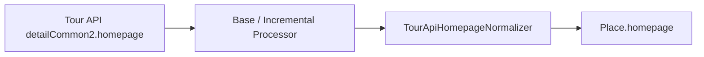

# Technical Specification: Tour API Homepage Normalization

**Document Status:** Final  
**Author:** 강민준 (joonamin44@gmail.com)  
**Date:** 2026-07-06  

## 1. 개요

### 1.1 목적

본 문서는 한국관광공사 Tour API `detailCommon2.homepage` 원문(HTML·혼합 텍스트)에서 `places.homepage`에 저장할 **단일 대표 URL**을 결정하는 정규화 규칙을 정의합니다.

### 1.2 범위

- **포함:** `TourApiHomepageNormalizer` 동작, 후보 추출·호스트 분류·대표 URL 선택 규칙, Base/Incremental processor 연동, 회귀 테스트 fixture
- **제외:** Tour API 호출, `PlaceItemWriter` upsert, homepage 외 필드 정규화

### 1.3 배경

기존에는 `TourApiBaseItemProcessor`, `TourApiIncrementalItemProcessor`에 homepage 파싱 로직이 각각 인라인으로 존재했습니다. Tour API 원문의 HTML anchor, 라벨+URL 혼합, Instagram handle, 다중 도메인 혼재 등 케이스가 늘면서 중복 구현과 회귀 위험이 커졌습니다.

이번 변경에서는 homepage 정규화를 `TourApiHomepageNormalizer`로 분리하고, 실제 실패 유형 기반 fixture 테스트를 추가했습니다.

---

## 2. 시스템 연동

### 2.1 구현 위치

| 구성 요소 | 역할 |
| :--- | :--- |
| `kr.bi.go_to.batch.mapper.TourApiHomepageNormalizer` | homepage 원문 → 대표 URL 정규화 (stateless static utility) |
| `TourApiBaseItemProcessor` | 초기 적재 시 `TourApiHomepageNormalizer.normalize(dto.homepage())` 호출 |
| `TourApiIncrementalItemProcessor` | 증분 상세 보강 시 `TourApiHomepageNormalizer.normalize(rawHomepage)` 호출 |

두 processor는 homepage 파싱 규칙을 직접 소유하지 않고 normalizer static 메서드에 위임합니다.

### 2.2 데이터 흐름

---

## 3. 입력·출력 계약

### 3.1 입력

- 필드: Tour API `homepage` 원문 문자열 (`rawHomepage`)
- HTML entity, anchor 태그, 라벨 텍스트, bare domain, Instagram handle이 혼재할 수 있음

### 3.2 출력

| 입력 조건 | 반환값 | 의미 |
| :--- | :--- | :--- |
| `null` | `null` | 원문 자체가 없음 |
| 공백만 있는 문자열 | `""` | homepage 없음 |
| 대표 URL 1개로 확정 가능 | 정규화된 URL 문자열 | `places.homepage` 저장값 |
| 대표 URL을 확정할 수 없음 | `null` | 모호함·후보 없음 → 저장하지 않음 |

**정책:** 잘못된 단일 URL을 저장하는 것보다 `null`을 허용합니다.

---

## 4. 정규화 파이프라인

### 4.1 전처리

1. `null`이면 즉시 `null` 반환
2. `StringUtils.hasText`가 false이면 `""` 반환
3. `HtmlUtils.htmlUnescape` 후 `trim`

### 4.2 후보 추출 순서

동일 원문에서 아래 순서로 후보를 수집합니다.

1. HTML `href="..."` 속성값 (`fromHref = true`)
2. HTML 태그 제거 후 일반 텍스트 URL 패턴
   - Instagram handle 영역은 URL 추출 전 공백으로 치환해 `@` handle이 URL로 오인되지 않게 함
3. HTML 태그 제거 후 Instagram handle (`@username`)
   - `https://www.instagram.com/{username}`으로 변환

### 4.3 URL 토큰 정제

각 후보 토큰은 아래 규칙을 거칩니다.

- 공백 제거
- 끝자리 `.`, `,`, `)`, `]` 제거
- scheme 없으면 `https://` 접두사 추가
- `URI` 파싱 실패 또는 host 없음 → 후보 제외
- scheme/host 소문자화, path/query/fragment 유지

### 4.4 중복 제거

- 비교 키: `http://`를 `https://`로 치환한 normalized URL
- 동일 URL이면 `fromHref = true` 후보를 우선

### 4.5 호스트 그룹화

- `www.` 접두사 제거 후 소문자 host로 그룹화
- 동일 host 그룹 내 대표 후보 선택 규칙:
  1. `fromHref = true` 우선
  2. path 길이가 긴 URL 우선
  3. 원문에서 먼저 발견된 순서(`order`) 우선

---

## 5. 호스트 분류

### 5.1 Auxiliary Host (보조 채널)

아래 suffix와 정확히 일치하거나 서브도메인으로 끝나는 host는 보조 채널로 분류합니다.

- `instagram.com`
- `facebook.com`
- `youtube.com`, `youtu.be`
- `x.com`, `twitter.com`
- `blog.naver.com`, `cafe.naver.com`, `smartstore.naver.com`, `naver.me`
- `booking.com`
- `airbnb.co.kr`, `airbnb.com`
- `modoo.at`, `linktr.ee`, `tistory.com`

### 5.2 Primary Host

위 Auxiliary 목록에 해당하지 않는 host

---

## 6. 대표 URL 결정 규칙

| 조건 | 결과 |
| :--- | :--- |
| Primary host 그룹이 정확히 1개 | 해당 그룹의 최적 URL |
| Primary host 그룹이 2개 이상 | `null` |
| Primary 없음, host 그룹이 1개 | 해당 그룹의 최적 URL (보조 채널 단일 종류 포함) |
| Primary 없음, 서로 다른 host 그룹이 2개 이상 | `null` |
| 유효 후보 없음 | `null` |

### 6.1 대표적인 케이스

| 유형 | 예시 | 결과 |
| :--- | :--- | :--- |
| anchor 상세 href | `<a href=".../detail?...">축약 URL</a>` | href의 상세 URL |
| 라벨 + URL | `문경 문화관광 https://www.gbmg.go.kr/tour` | URL만 추출 |
| bare domain | `ulvine.com` | `https://ulvine.com` |
| Instagram handle | `@bbang.dabang` | `https://www.instagram.com/bbang.dabang` |
| Primary + Auxiliary | 공식 홈페이지 + Instagram | Primary URL |
| 다중 Primary | 서로 다른 기관/도메인 URL 2개 이상 | `null` |
| 다중 Auxiliary | 스마트스토어 + Instagram + 블로그 | `null` |
| 이메일만 존재 | `문의 test@example.com` | `null` |

---

## 7. 테스트

### 7.1 단위 테스트

- 클래스: `TourApiHomepageNormalizerTest`
- 핵심 시나리오: 빈 문자열, 라벨+URL, Instagram handle, bare domain, anchor href 우선, 다중 Primary/Auxiliary, 이메일 제외

### 7.2 Fixture 기반 회귀 테스트

- 파일: `src/test/resources/fixtures/tour-api-homepage-normalization-cases.tsv`
- 컬럼: `type`, `raw_homepage`, `expected_homepage`
- `expected_homepage = __NULL__`이면 `null` 기대
- `\n`은 fixture에서 이스케이프 가능

fixture `type` 예시:

- `ANCHOR_DETAIL_HREF`
- `LABEL_URL`
- `BARE_DOMAIN`
- `INSTAGRAM_HANDLE`
- `PRIMARY_WITH_AUXILIARY`
- `DIFFERENT_PRIMARY_DOMAINS`
- `MULTIPLE_PRIMARY_URLS`
- `MULTIPLE_AUXILIARY_URLS`
- `EMAIL_ONLY`

새로운 Tour API homepage 실패 유형이 발견되면 fixture row를 먼저 추가한 뒤 normalizer를 수정합니다.

---

## 8. 운영 주의사항

- homepage 정규화 변경은 초기 적재와 증분 상세 보강 모두에 영향을 줍니다.
- `null` 반환 정책 변경은 기존 `places.homepage` 값의 backfill 여부를 별도 검토해야 합니다.
- Auxiliary host 목록 확장은 spec과 `AUXILIARY_HOST_SUFFIXES` 상수를 함께 갱신해야 합니다.
