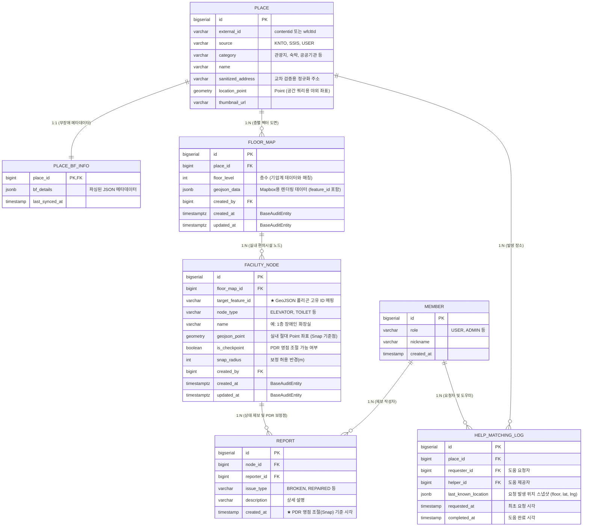

## 1. 데이터 모델링 및 ERD

### 1.1. 최종 ERD 구조

- 외부 ID와 내부 대리키를 분리
  - source 가 다른 데이터셋에서 id 중복을 방지하기 위함



### 1.2. 무장애 정보 JSONB 스키마 구조

PostgreSQL의 JSONB 타입의 장점을 극대화하기 위해, 장애 유형 및 사용자 목적에 따라 카테고리화된 구조를 채택합니다. 검색의 핵심인 `is_available`을 최우선 필드로 둡니다.

```json
{
  "mobility": {
    "wheelchair": { "is_available": true, "count": 2, "details": "수동휠체어 2대 대여가능" },
    "parking": { "is_available": true, "count": null, "details": "장애인 전용 주차장 1면 있음" },
    "elevator": { "is_available": false, "details": "단차로 인해 휠체어 접근 불가" }
  },
  "visual": {
    "guide_dog": { "is_available": true, "details": "안내견 동반 환영" },
    "braille_block": { "is_available": true, "details": "주출입구 점자블록 있음" }
  },
  "hearing": {
    "sign_guide": { "is_available": false, "details": "" }
  },
  "infant_family": {
    "stroller": { "is_available": true, "count": 5, "details": "유모차 5대 대여가능" },
    "nursing_room": { "is_available": true, "details": "1층 수유실 위치" }
  }
}
```

------

## 2. 인덱스 및 성능 최적화 포인트

Upsert 트랜잭션 자체의 부하는 미미하나, Transform 단계의 **공간 쿼리 및 문자열 유사도 비교**에서 발생할 수 있는 병목을 사전에 차단합니다.

- **공간 인덱스**: `PLACE` 테이블의 `location_point` 컬럼에 `GIST` 인덱스 생성.
- **문자열 인덱스**: `PLACE` 테이블의 `name` 컬럼에 `pg_trgm` 확장을 이용한 `GIN` 인덱스 생성.
- **JSON 인덱스**: `PLACE_BF_INFO` 테이블의 `bf_details` 컬럼 내 주요 필드(`is_available`)에 대해 GIN 인덱스 생성 고려 (빠른 조건 검색용).

## 3. 층별 지도 표현 방법

- 예시 이미지

  

- `FLOOR_MAP.geojson_data`

  ```java
      {
        "type": "FeatureCollection",
        "features": [
          {
            "type": "Feature",
            "properties": { "name": "복도", "color": "회색", "node_id": id1 },
            "geometry": { "type": "Polygon", "coordinates": [...] }
          },
          {
            "type": "Feature",
            "properties": { "name": "유니클로", "color": "파란색", "node_id": id2 },
            "geometry": { "type": "Polygon", "coordinates": [...] }
          },
          {
            "type": "Feature",
            "properties": { "name": "화장실 공간", "color": "흰색", "node_id": id3 },
            "geometry": { "type": "Polygon", "coordinates": [...] }
          }
        ]
      }
  ```

  - 특정 

    ```
    feature
    ```

     의 

    ```
    ${properties.node_id}
    ```

     와 

    ```
    FACILITY_NODE.target_feature_id
    ```

     는 FK로 연결됨

    - 렌더링되는 뷰는 `FLOOR_MAP.geojson_data`의 feature로 표현하고

    - 실제 데이터소스는 

      ```
      FACILITY_NODE
      ```

       로 관리됨

      - `FACILITY_NODE.node_type` 에 따라서 보여지는 데이터의 유형을 변동시킬 수 있음 (확장성 포인트)
      - 또한 추후에 `PDR 초점계산`에서 ‘면’으로 표현된 시설을 대표 위치인 `point` 로 매핑시키기 위한 `geojson_point` 로 매핑 (⇒ 백그라운드 계산을 위한 키)